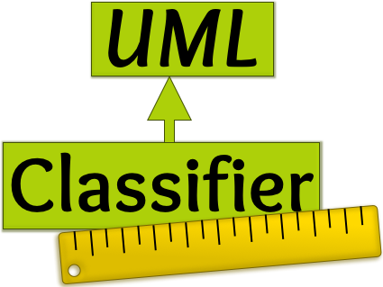

## Classifier

Classifier ist ein kostenloses Tool zur Modellierung von UML-Klassendiagrammen. Der Classifier wurde 2022 im Umfang meiner Bachelorarbeit an der Hochschule Bochum für das "Labor für Angewandte Informatik & Datenbanken" (AID-Labor) entwickelt und soll für die Lehre in der Vorlesung "Informatik 2" in den Bachelor-Studiengängen Elektrotechnik sowie Wirtschaftsingenieurswesen Elektrotechnik eingesetzt werden. Die Bachelorarbeit wurde betreut von Prof. Dr. rer. nat. Katrin Brabender und Dipl.-Ing. (FH) Andreas Koch, bei denen ich mich herzlich für die Zusammenarbeit bedanke.

### Download

[Aktuelle Version](https://github.com/AID-Labor/classifier/releases/latest)

### Javadoc

[Dokumentation](1.0.3/index.html)

### Screenshots
_in Erstellung_
